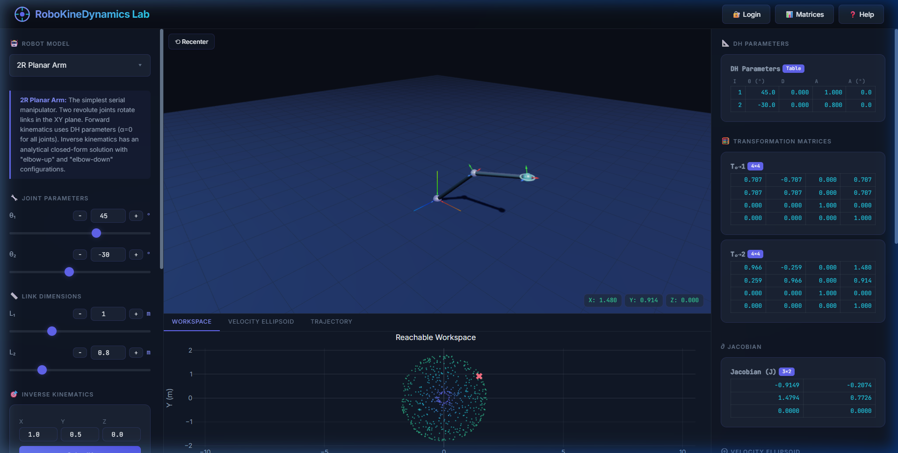
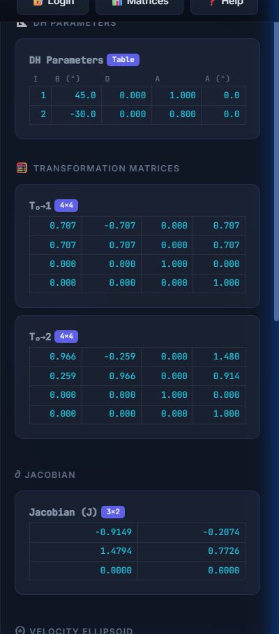
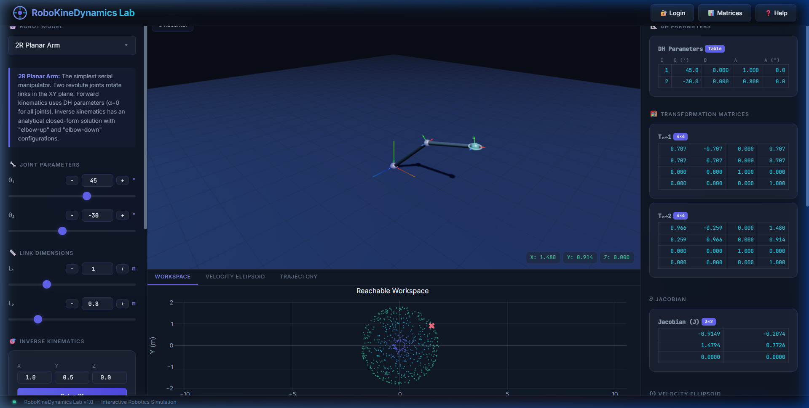
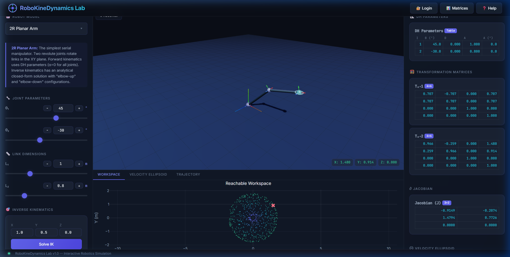

# 🤖 RoboKineDynamics Lab

> **An interactive, browser-based robotics kinematics & dynamics visualization platform.**  
> Learn Forward Kinematics, Inverse Kinematics, Jacobian analysis, workspace reachability, and trajectory planning — all in real time with a stunning 3D interface.

---

## 🖼️ Screenshots

<p align="center">
  
  <em>Main Interface · 3D robot arm with live kinematics and DH parameter table</em>
</p>

<p align="center">
  
  &nbsp;
  
</p>
<p align="center">
  <em>Transformation Matrices + Jacobian Panel &nbsp;&nbsp;&nbsp; · &nbsp;&nbsp;&nbsp; Robot Model Selector</em>
</p>

<p align="center">
  
  <em>Interactive Plotly Plots · Reachable Workspace, Velocity Ellipsoid & Trajectory</em>
</p>

---

## ✨ Features

| Feature | Description |
|---|---|
| **3D Robot Visualization** | Live Three.js rendering with coordinate frames, joint spheres, and link geometry |
| **Forward Kinematics (FK)** | DH-parameter-based FK with real-time 4×4 transformation matrices |
| **Inverse Kinematics (IK)** | Analytical closed-form IK solver for planar arms + iterative Jacobian-based solver |
| **Jacobian Matrix** | Real-time 6×n Jacobian display and manipulability index |
| **Velocity Ellipsoid** | Visual and numerical velocity ellipsoid via SVD of the Jacobian |
| **Workspace Analysis** | Plotly scatter plot of the full reachable workspace with dexterity coloring |
| **Trajectory Planner** | Linear joint-space interpolation and Cubic Spline planning with playback animation |
| **Dynamics Engine** | Mass/inertia-based dynamic computation display (torques, inertia matrix) |
| **Cloud Save/Load** | Supabase-backed user authentication and configuration persistence |
| **Snapshot & Export** | Take PNG snapshots of the 3D scene and export joint config to JSON |
| **Multi-Robot Support** | Switchable robot models (2R Planar Arm and more) with live educational descriptions |

---

## 🧰 Tech Stack

- **Frontend:** Vanilla HTML5, CSS3, JavaScript (ES6+)
- **3D Rendering:** [Three.js r128](https://threejs.org/) with OrbitControls & TransformControls
- **Plotting:** [Plotly.js 2.27](https://plotly.com/javascript/)
- **Cloud Backend:** [Supabase](https://supabase.com/) (Auth + PostgreSQL)
- **Fonts:** Google Fonts (Inter, JetBrains Mono)
- **No build tools required** — runs entirely from a single `index.html`

---

## 🚀 Getting Started

### Option 1 — Open Directly (No Server)
```bash
# Clone the repository
git clone https://github.com/mohammedfarazfz21/RoboKineDynamicsLab.git
cd RoboKineDynamicsLab

# Open index.html in your browser
start index.html   # Windows
open index.html    # macOS
xdg-open index.html  # Linux
```

### Option 2 — Serve with Python (Recommended)
```bash
# Python 3
python -m http.server 3000

# Then visit:
# http://localhost:3000
```

### Option 3 — VS Code Live Server
Install the **Live Server** extension and click **Go Live** on `index.html`.

---

## ☁️ Enabling Cloud Features (Supabase)

Cloud save/load and user authentication require a free Supabase project:

1. Go to [supabase.com](https://supabase.com) and create a free project.
2. Navigate to **Settings → API** and copy your **Project URL** and **anon public** key.
3. Open `scripts/auth.js` and replace the placeholder values:
   ```js
   const SUPABASE_URL  = 'https://YOUR_PROJECT.supabase.co';
   const SUPABASE_ANON = 'YOUR_ANON_KEY';
   ```
4. In the Supabase SQL editor, run:
   ```sql
   CREATE TABLE configurations (
     id UUID PRIMARY KEY DEFAULT gen_random_uuid(),
     user_id UUID REFERENCES auth.users(id),
     name TEXT NOT NULL,
     data JSONB NOT NULL,
     created_at TIMESTAMPTZ DEFAULT NOW()
   );
   ALTER TABLE configurations ENABLE ROW LEVEL SECURITY;
   CREATE POLICY "Users manage own configs"
     ON configurations FOR ALL
     USING (auth.uid() = user_id);
   ```
5. Refresh the app — Login and Cloud Save are now active!

> **Without Supabase** the app runs fully in offline mode with all kinematics/dynamics features available.

---

## 📁 Project Structure

```
RoboKineDynamicsLab/
├── index.html              # Main application shell
├── styles/
│   └── style.css           # Full design system & layout
├── scripts/
│   ├── auth.js             # Supabase authentication & cloud persistence
│   ├── kinematics.js       # FK, IK, Jacobian, dynamics engine
│   ├── visualizer.js       # Three.js 3D renderer & scene management
│   ├── planner.js          # Trajectory planner (linear + cubic spline)
│   └── ui.js               # UI bindings, sliders, modals, plot updates
└── screenshots/            # Platform screenshots for documentation
    ├── 01_main_interface.png
    ├── 02_matrices_panel.png
    ├── 03_robot_selection.png
    └── 04_analysis_plots.png
```

---

## 🎓 Educational Value

This platform is designed to teach core robotics concepts visually:

- **Denavit-Hartenberg Convention** — See how α, d, a, θ parameters map to 4×4 homogeneous transforms
- **Forward Kinematics** — Watch how joint angles propagate through the kinematic chain in real time
- **Inverse Kinematics** — Solve for joint angles given an end-effector target position (X, Y, Z)
- **Jacobian Analysis** — Understand the relationship between joint velocities and end-effector velocities
- **Singularities** — Identify configurations where the robot loses DOF through the velocity ellipsoid
- **Trajectory Planning** — Compare linear and cubic spline interpolation for smooth joint-space motion
- **Newton-Euler Dynamics** — Explore torque computations and inertia matrices

---

## 🤝 Contributing

Pull requests are welcome! For major changes, please open an issue first.

1. Fork the repository
2. Create a feature branch: `git checkout -b feature/my-feature`
3. Commit your changes: `git commit -m 'Add my feature'`
4. Push to the branch: `git push origin feature/my-feature`
5. Open a Pull Request

---

## 📄 License

This project is open source and available under the [MIT License](LICENSE).

---

<p align="center">
  Built with ❤️ for robotics education · <a href="https://github.com/mohammedfarazfz21/RoboKineDynamicsLab">RoboKineDynamics Lab</a>
</p>
